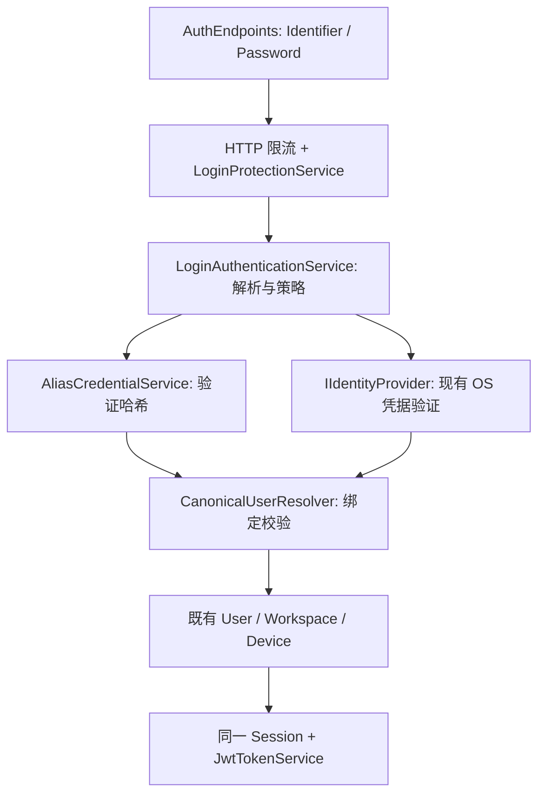

# RelaxKonOS Alias Login / 独立登录别名认证（Goal 执行版）

> 状态：设计完成，待实施；本文不代表功能已经实现。
>
> 建立日期：2026-09-12。代码基线：`a75f5f4`，并核对当前工作区。
>
> 范围：`RelaxKonOS.Server`、共享 Protocol、Avalonia `RelaxKonOS.Client`；Linux / Windows Server。
>
> 本次交付仅新增设计文档及文档索引，不修改运行时代码、数据库、账号或配置。

## 1. Background / 背景

在宿主 OS 账号认证之外增加 RelaxKonOS 自管登录凭据。用户先使用真实系统账号登录，再在 Settings 创建 Alias 和独立密码。`developer + AliasPassword` 与 `nanami + SystemPassword` 最终必须得到同一个 `User.Id` 和 Workspace。

系统身份与登录凭据必须分离：Alias 不是新 OS 用户，也不是第二个 RelaxKonOS 用户。关闭系统账号直接登录只改变 RelaxKonOS 登录入口的策略。

文档沿用仓库按领域组织、以 `RelaxKonOS.*.Goal.md` 命名的规范。相关背景见 [Authentication](./RelaxKonOS.Authentication.md)、[Login](./RelaxKonOS.Login.md)、[Storage](./RelaxKonOS.Storage.md)、[Settings](../desktop/RelaxKonOS.Settings.md)。这些文档中的历史描述不能替代下面的真实代码分析。

## 2. Current State / 当前状态

| 领域 | 已核实的实现 | 对本 Goal 的影响 |
|---|---|---|
| HTTP 认证 | Minimal API `AuthEndpoints.MapAuthEndpoints`，`POST /api/v1.0/auth/login`，请求字段为 `username` | 不另建 `/api/auth/login` 或 Controller；在现有入口分派凭据 |
| OS 认证 | `IIdentityProvider.Verify` + `GetUserInfo`；Linux PAM/NSS，Windows LogonUser | 保留 OS provider，Alias 验证放在其上层 |
| 用户 | `User.Id` 为 GUID；查找索引是 `(Username, Platform)`，且登录用的是请求的 `ClientPlatform` | 同一宿主账号可能被客户端平台或用户名写法拆成多条 User；必须先修正 |
| 系统标识 | Linux 返回 UID；Windows `PlatformUserInfo.Uid` 实际为 `DOMAIN\user` | 当前不能宣称 Windows 已按 SID 建立稳定绑定 |
| 会话 | `Domain.Session`、`AuthSessionStore` 均为内存；后者原子消费 Refresh Token | 可复用签发/刷新；缺用户级撤销及一致的 Session ID |
| 防护 | HTTP Token Bucket；账号、IP、账号+IP 失败保护；SQLite 安全事件 | 不是从零添加 RateLimiter；需统一两类凭据的账号计数键 |
| 存储 | 默认 EF Core + SQLite，开发可选 memory；部分 HostGlobal 表有独立迁移器 | 新凭据使用业务 SQLite，不加新数据库 |
| 秘密 | Server 有 Data Protection 和专用于 Tunnel 的 `ISecretStore`；未发现密码 Hasher 的现有业务实现 | 可使用框架 PasswordHasher；不能把可逆 SecretStore 当密码哈希 |
| 前端 | Avalonia MVVM；Settings 当前有九个页面，没有 Account/Security 页 | 新增页面并接入导航、搜索、本地化和会话生命周期 |
| 本地记住登录 | `RememberedSessionStore` 保存用户选入的登录密码到 OS 安全存储 | 必须保存实际登录 Identifier，而不是返回的系统用户名 |

## 3. Goal / 目标

1. 每个 Canonical User 最多拥有一个有效 Alias Credential；初次创建必须现场复验本人的 OS 凭据。
2. 登录统一接收 Identifier / Password，准确区分 Alias 和系统账号，并复用同一 User、Workspace、Device、Session 签发链路。
3. 用户验证当前 Alias Password 后，可关闭自己的 RelaxKonOS 系统账号直接登录。
4. 支持查询、创建、改名、改密、删除 Alias 及恢复系统直接登录，防止并发修改和操作顺序造成锁死。
5. 现有无 Alias 用户默认 `SystemLoginEnabled = true`；有效现有身份保留原 User/Workspace ID。
6. 不改变权限授予规则，不让 Alias 名称或密码进入 OS 提权路径。

## 4. Non-Goals / 非目标

- 不创建、禁用或修改 Linux/Windows 用户，不保存或同步 OS 密码。
- 不增加完整 ASP.NET Core Identity 用户库、角色库、注册系统、邮箱找回、MFA、第三方 SSO 或多个 Alias。
- 不改变 SSH、SMB、SFTP、FTP、sudo、Windows ACL 或系统密码策略。
- 不把 OS 登录 token 变成长期持有的 impersonation token，不在本 Goal 重写 PTY/File/Docker 的执行身份模型。
- 不实现跨服务器统一账号、共享 Refresh Token 存储或集群认证。
- 不保留旧 API 字段、路由别名或双格式解析。遵守根 [AGENTS.md](../../AGENTS.md)：保留既有用户数据及默认登录能力，与保留旧线协议是两件事。

## 5. Terminology / 术语

| 名称 | 含义 |
|---|---|
| System Identity | 本服务器上的 OS 主体：宿主平台、UID/SID、规范系统账号名、Home 等 |
| Canonical User | 对上述主体的唯一 RelaxKonOS `User.Id`；Workspace 和业务数据的归属依据 |
| Identifier | 一次登录输入，可是系统账号名或 Alias；不能直接用作授权身份 |
| Alias Credential | 绑定已有 `User.Id` 的 Alias 和单向密码哈希 |
| SystemLoginEnabled | 允许该主体使用 OS 密码进入 RelaxKonOS 的本地认证策略 |
| AuthenticationMethod | `system` 或 `alias`，仅为凭据来源元数据，不是角色/权限 |
| Revision | Alias/策略配置的并发版本，防止过期页面覆盖新配置 |
| SecurityVersion | 用户级凭据撤销版本，令旧 token/session 不能继续通过认证 |
| Re-authentication | 在已认证请求中验证本人的当前凭据；不等于重新调用 login 创建 Session |

## 6. Existing Architecture Analysis / 真实代码分析

### 6.1 登录与身份

[AuthEndpoints.cs](../../RelaxKonOS.Server/Endpoints/AuthEndpoints.cs) 先调用 `LoginProtectionService.CheckAsync(req.Username, RemoteIpAddress)`，再调用 `IIdentityProvider.Verify`。失败路径已统一返回 `401 invalid-credential`，没有使用文件末尾仍保留的详细错误映射方法。成功后调用 `GetUserInfo`，按输入用户名和 **ClientPlatform** 查建用户，再查建 Workspace、初始化注册表默认项、复用 Device、创建 Session、更新 Controller 租约并签发 JWT。

[IIdentityProvider.cs](../../RelaxKonOS.Server/Identity/IIdentityProvider.cs) 的 `PlatformUserInfo` 只有 `Uid / DisplayName / HomeDirectory`，没有规范账号名、宿主平台及无密码账号状态查询契约。不能把输入 Alias 传入 `GetUserInfo`，也不能假设 `Verify` 的成功结果携带完整身份。

[LinuxPamProvider.cs](../../RelaxKonOS.Server/Identity/LinuxPamProvider.cs) 使用 PAM `login` 服务，先 `pam_authenticate` 后 `pam_acct_mgmt`；`getpwnam_r` 走 NSS，非只读 `/etc/passwd`。得到的规范名称目前仅用于 DisplayName 回退，没有独立返回。

[WindowsLogonProvider.cs](../../RelaxKonOS.Server/Identity/WindowsLogonProvider.cs) 使用 `LOGON32_LOGON_NETWORK`，支持代码中的裸用户名、`DOMAIN\user` 和 `user@domain` 解析，token 在 finally 关闭。`GetUserInfo` 用 `LookupAccountName` 检查存在、通过 SID 查 ProfileList/Home，但返回的 `Uid` 仍是名称字符串；UPN 被拆分成 user/domain，并未证明适用于所有域配置。应按成功 token 的 SID 核对身份，不以 DisplayName 或解析后的字符串充当 SID。

[User.cs](../../RelaxKonOS.Server/Domain/User.cs)、[SqliteUserRepository.cs](../../RelaxKonOS.Server/Storage/Sqlite/SqliteUserRepository.cs) 和 [RelaxKonOSDbContext.cs](../../RelaxKonOS.Server/Storage/Sqlite/RelaxKonOSDbContext.cs) 明确显示：现有唯一键不是 UID/SID。现状会阻碍“同一真实用户只有一个 Canonical User”的目标，不能仅给登录页增加 Alias 字段。

### 6.2 Session / Token / Cookie

[JwtTokenService.cs](../../RelaxKonOS.Server/Identity/JwtTokenService.cs) 签发 HS256 JWT，含 `sub=User.Id`、`name=User.Username`、workspace/device/role/jti；Refresh Token 为随机 32 字节，登记到 [AuthSessionStore.cs](../../RelaxKonOS.Server/Identity/AuthSessionStore.cs) 的内存字典。`TryConsume` 原子移除一次性 Refresh Token；刷新保持 `RefreshRecord.SessionId` 和绝对到期时间。默认 Access 15 分钟、Refresh 空闲 7 天、绝对 30 天，见 [JwtOptions.cs](../../RelaxKonOS.Server/Identity/JwtOptions.cs)。

当前缺口：登录创建的 `Domain.Session.Id` 没传给 `jwt.Issue`，该方法另生成 Session ID；JWT 没有 `sid`、认证方法或安全版本；logout 只撤销提交的 Refresh Token，Access Token 自然到期；刷新不重新校验 OS 主体；没有按用户撤销 API。

[Program.cs](../../RelaxKonOS.Server/Program.cs) 注册 User/FileCapability 两类 JWT Bearer scheme，未注册 Cookie 登录。部分 Hub 支持查询串 `access_token`；当前只有 SettingsChangesHub 显式设置 `CloseOnAuthenticationExpiration`。因此“删除 refresh 记录”不等于立即撤销 REST 与已连接 Hub。

### 6.3 Authorization 与宿主操作

[FileEndpoints.cs](../../RelaxKonOS.Server/Endpoints/FileEndpoints.cs) 的 Special 路径通过 token subject 查 User，再用 `user.Username` 取 Home。文件普通 I/O 以服务进程身份执行，特权操作另经 Helper；不能把“登录成功”描述为已经在 OS 上 impersonate 该用户。

[TerminalUserIdProvider.cs](../../RelaxKonOS.Server/Terminal/TerminalUserIdProvider.cs)、[TerminalHub.cs](../../RelaxKonOS.Server/Hubs/TerminalHub.cs) 和 [TerminalSessionManager.cs](../../RelaxKonOS.Server/Terminal/TerminalSessionManager.cs) 按用户 subject 隔离 PTY 归属；PTY 的创建并没有把 Alias 或登录密码变成 OS logon token，默认目录还会取服务进程的 UserProfile。此历史限制单独记录，不借 Alias 重构终端。

[HostAdministratorAuthenticator.cs](../../RelaxKonOS.Server/Privileged/HostAdministratorAuthenticator.cs)、[FirewallChangeAuthorizationService.cs](../../RelaxKonOS.Server/Firewall/FirewallChangeAuthorizationService.cs)、[RunAsAuthorizationService.cs](../../RelaxKonOS.Server/ProcessGuardian/RunAsAuthorizationService.cs) 有 OS 密码复验和各自的管理员/RunAs 规则。[HostElevationSessionStore.cs](../../RelaxKonOS.Server/Privileged/HostElevationSessionStore.cs) 是绑定 jti、subject、capability、target 的五分钟授权，不能直接复用为 Alias 管理授权。

[HostEnvironmentService.ResolveTarget](../../RelaxKonOS.Server/Settings/HostEnvironmentService.cs) 当前在 Windows 将 `user.Username` 和 `user.PlatformIdentity` 都作为 NTAccount 名称翻译成 SID，再比较；Linux 检查 Platform、UID 与 NSS 结果。PlatformIdentity 改为真 SID 时必须同步修改这里，直接解析并核验存储 SID，不能把 SID 文本再当账号名，也不能留下“先按 SID、失败再按名称”的双格式分支。这是身份接口升级的必要调用者修改，环境配置权限和 Helper 目标规则保持不变。

Helper 的 [Program.cs](../../RelaxKonOS.PrivilegedHelper/Program.cs)、[WindowsPrivilegedPipeServer.cs](../../RelaxKonOS.PrivilegedHelper/WindowsPrivilegedPipeServer.cs) 和 [说明](../../RelaxKonOS.PrivilegedHelper/README.md) 对应 Linux 本地进程、Windows 认证命名管道和封闭操作集。正常 Alias 操作只写 Server 自己的 SQLite，无需新增 Helper 命令、sudoers 或管道权限。

### 6.4 Settings、客户端与存储

[SettingsViewModel.cs](../../Client/RelaxKonOS.Client/Apps/Settings/ViewModels/SettingsViewModel.cs) 实际 Pages 为 System、Environment、Personalization、TimeLanguage、Network、Apps、ImageMirrors、DefaultApps、Developer；注释中的“八个分类”和旧文档中的“五个分类”不是当前状态。[SettingsViewModel.Navigation.cs](../../Client/RelaxKonOS.Client/Apps/Settings/ViewModels/SettingsViewModel.Navigation.cs) 提供导航历史、搜索索引和连接切换处理；[SettingsView.axaml](../../Client/RelaxKonOS.Client/Apps/Settings/Views/SettingsView.axaml) 用 DataTemplate 映射页面。

[WorkspaceSettingsService.cs](../../RelaxKonOS.Server/Settings/WorkspaceSettingsService.cs) 当前把偏好保存到注册表 `WorkspaceConfigurationRegistry`，而不是沿用旧 Workspace JSON 列。Alias 是认证数据，不应放入 WorkspacePreferences、通用 Registry、AppSettings、ShellSettings 或用户 Home 文件。

[LoginViewModel.cs](../../Client/RelaxKonOS.Client/ViewModels/Login/LoginViewModel.cs) / [LoginView.axaml](../../Client/RelaxKonOS.Client/Views/Login/LoginView.axaml) 收集用户名密码，经 `IAuthSession`、[AuthSession.cs](../../Client/RelaxKonOS.Client/Services/Auth/AuthSession.cs)、[RelaxKonOSClient.cs](../../Client/RelaxKonOS.Client/Services/Auth/RelaxKonOSClient.cs) 调 Protocol API。AuthSession 以 LoginResponse 设置 CurrentUser/Workspace；用串行刷新门防止重复消费，刷新 401 清空认证状态。

[RememberedSessionStore.cs](../../Client/RelaxKonOS.Client/Services/Auth/RememberedSessionStore.cs) 在用户选择记住密码后使用 Windows DPAPI、macOS Keychain、Linux Secret Service；Linux 连接元数据另存 JSON。不能把服务端“不存 OS 密码”的事实扩大为“客户端从不保存密码”。文件中的旧格式迁移代码是既有事实，本 Goal 不复制或新增此类兼容分支。

[StorageOptions.cs](../../RelaxKonOS.Server/Storage/StorageOptions.cs) 默认 `data/relaxkonos.db`，相对 ContentRoot。业务 DbContext 用 EnsureCreated 加 Program 内补表 SQL；[HostGlobalMigrationRunner.cs](../../RelaxKonOS.Server/Storage/Sqlite/HostGlobalMigrationRunner.cs) 为宿主资源单独维护版本迁移。[DataProtectionSecretStore.cs](../../RelaxKonOS.Server/Secrets/DataProtectionSecretStore.cs) 是 Tunnel token 的可逆密文存储，不是通用密码验证器。

### 6.5 已有防护及泄密风险

[LoginProtectionService.cs](../../RelaxKonOS.Server/Identity/LoginProtectionService.cs) 的账号键是 Trim/大写/截断 128 字符，不能作为身份唯一键；两种凭据目前也没有合并计数。IP 与账号+IP 状态是进程内静态字典，账号状态和安全事件走 [AuthenticationProtectionStore.cs](../../RelaxKonOS.Server/Storage/AuthenticationProtectionStore.cs)。需补并发更新、过期清理、容量限制；不能声称已具备持久化多节点防护。

[NetworkDiagnosticsHandler.cs](../../Client/RelaxKonOS.Client/Services/Diagnostics/NetworkDiagnosticsHandler.cs) 在启用诊断时采集请求/响应头及正文；[NetworkDiagnosticsService.cs](../../Client/RelaxKonOS.Client/Services/Diagnostics/NetworkDiagnosticsService.cs) 要求 DeveloperMode 和已认证会话，没有通用敏感字段脱敏。这尤其会暴露登录后提交的 Alias/复验密码及刷新 token。必须在新接口上线前修复采集边界，不能只隐藏 UI 展示。

## 7. Proposed Architecture / 推荐架构



最小新增组件建议：

- `LoginAuthenticationService`：一个编排服务，解析 Identifier、执行本地策略、调用凭据验证并返回可信 User 与方法。Identifier Resolution 就放在这里，不散落到前端、Hasher 或各个 OS provider。
- `CanonicalUserResolver`：统一 OS 主体→User 查找和绑定检查，修复 ClientPlatform 参与身份的问题。
- `AliasCredentialService` + `IAliasCredentialRepository`：管理唯一 Alias、HashedPassword、策略、并发版本和原子更新；SQLite 生产实现、memory 测试实现。
- 独立注入 `IPasswordHasher<AliasCredential>`，不引入 UserManager/SignInManager/Identity EF schema。

`IIdentityProvider` 仍专指 OS。直接升级其成功身份结果及只读 lookup 契约，使 Verify 成功可返回可信规范账号名、宿主平台与 UID/SID；GetUserInfo 的已有调用者一并更新。不保留仅为旧接口服务的重载。账号状态查询可作为该接口的窄方法，不先搭建通用 Provider 插件注册框架。

Alias 分支不得调用 OS 密码验证、不得调用 `users.Add`；只有首次真实 OS 登录能创建 Canonical User。两条路径汇合后复用现有 Workspace/Device/租约逻辑，不以 AuthenticationMethod 分配角色。

## 8. Identity Model / 身份模型

### 8.1 唯一主体

保留 `User.Id` GUID 作为业务主键；`User.Platform` 改为 **Server 宿主 OS 平台**，`PlatformIdentity` 明确为 Linux 十进制 UID / Windows 字符串 SID。Device.Platform 仍来自客户端。User.Username 存 provider 返回的规范系统名称，绝不存 Alias。

在单服务器、单业务库范围建立 `(Platform, PlatformIdentity)` 唯一约束。部署库绑定本宿主，不能直接拷到另一台机器按相同 UID 自动认领；换宿主恢复须先验证身份绑定。无需为此建立跨主机身份服务。

Alias 记录只引用 `User.Id`；不能让请求提交目标 UserId、SID、UID、Home、角色或 Workspace。Windows 登录使用成功 token 的 SID，并在 lookup 元信息时再次核对；Linux 使用 PAM 验证主体和 NSS 结果，禁止在两步间静默更换到另一个 UID。

### 8.2 生命周期与混淆防护

- 每次 Alias 登录、敏感修改及 Refresh，确认绑定账号存在且仍为同一 UID/SID；名字对应不同身份时拒绝，不能更新绑定“修复”。
- OS 改名可在用 UID/SID 反查并核实一致后更新规范名称，保留 User.Id、WorkspaceId 和 Alias；不自动绑定名字相同的新用户。
- 删除、失效或状态无法确认时 Alias 拒绝，产生内部事件；已观察到删除/身份冲突的绑定持久化为待人工确认，不能在同 UID 再出现时自动激活。
- Linux UID 不是账号实例的不可复用标识。删除后同名同 UID 重建且发生在两次检查之间，单靠 NSS 无法可靠辨认。运维必须在删除/复用 UID 前撤销 Alias；文档和测试不得承诺消除这个残余风险。
- Home 和权限每次从真实主体/现有授权服务获取，不能信任 Alias 记录缓存的路径。

### 8.3 既有重复 User 是发布前置问题

先运行只读预检，找出同 UID/SID 对应多个 User/Workspace、Windows 多种名称写法、ClientPlatform 导致的重复数据及无法解析的旧记录。唯一映射保留原 GUID；冲突不得自动选“最早”User、按名字合并或重分配 Workspace。须在上线前由操作者核对数据归属并明确处理，见 §18。这是当前代码带来的约束，不应在实施时掩盖。

## 9. Authentication Flow / 登录流程及 Alias 规则

### 9.1 Identifier 的唯一解析

V1 采用**共用可登录 Identifier 命名空间**，保留用户期望的裸 `developer` 登录，不新增登录模式选择或尝试两个密码库。

| 规则 | 决策 |
|---|---|
| 长度 | 3–32 个 ASCII 字符 |
| 允许字符 | `^[a-z][a-z0-9._-]{2,31}$`，以小写字母开头 |
| 大小写 | Alias 大小写敏感，只接受上述小写形式；不自动 lowercase/Trim 输入。Windows OS 名称继续遵循 Windows 大小写规则 |
| Unicode / 空格 | Alias 禁止 Unicode、空格、控制字符；系统账号仍使用现有 provider 支持的语法，密码不按此规则限制 |
| 域/特殊语法 | Alias 禁止 `@`、`\`、`/`、`:`，避免与域账户、UPN、路径混淆 |
| 保留名称 | 至少 `root`、`admin`、`administrator`、`system`、`guest`、`anonymous`、`support`、`relaxkonos`；有版本的服务端常量，不用于禁止真实 OS 登录 |
| Alias 冲突 | SQLite Alias 唯一索引；检查自身系统名也视为冲突，避免两个密码都能解释为同一输入 |
| 系统账号冲突 | 创建/改名实时通过 OS lookup 判断该裸 Identifier 是否可解析为系统主体，不只查已登录的 users 表 |

Linux 使用 NSS 的精确名称查找，故系统 `Developer` 与 Alias `developer` 是两个不同输入；UI 明确 Alias 必须小写。Windows 按其账号解析语义检测大小写不敏感冲突，裸 Alias 不会与域限定输入混淆。Windows 本地 `developer` 存在时，即使其未登录过 RelaxKonOS，也不能给 nanami 建立 `developer`。

系统查找必须区分 NotFound 与目录服务不可用；不可用不等于“名称可用”。无需枚举整个 LDAP/域目录：对所有当前接受的裸输入解析规则做点查询；若某配置存在无法准确检测的多义解析，禁用该配置的 Alias 支持并保留系统认证。

宿主管理员可以在 Alias 创建之后新建同名 OS 用户，数据库事务无法锁住外部账号数据库。因此每次登录重新检测：Alias 与系统 lookup 同时命中同一输入时，该输入**拒绝登录**，内部记录 collision；不优先 Alias、不优先 OS、不按密码试错。已认证用户仍可在专用设置接口按 UserId 验证 Alias 密码并改名；无会话者使用控制台恢复。OS 变更与请求之间仍有 TOCTOU 窗口，绑定 UID/SID 的复核必须保证窗口不能把 Alias A 映到 User B。

### 9.2 入口执行顺序

1. 验证请求形状和长度（Identifier 总长上限 256，Password UTF-8 上限 1024 bytes；Alias 另按上表）。不裁剪密码。
2. HTTP IP 限流及未解析 Identifier 防护，之后查 Alias 和 OS 输入解析结果；一旦获得 UserId，先执行 Canonical User 维度防护，再做任何密码运算。不要在限流前执行昂贵密码运算。
3. 命中 Alias：检查冲突；验证 Alias 哈希；从记录取 UserId；核验绑定和账号资格。失败不再尝试系统密码。
4. 仅命中系统账号：用 UID/SID 找本地策略，检查 `SystemLoginEnabled`；关闭时不调用 PAM/LogonUser。开启时执行现有 OS Verify，再核对成功主体与策略检查的主体一致。
5. 未知 Identifier 做受限的 dummy hash 验证并统一拒绝；provider/DB 故障按 §21 处理，不能默认放行策略。
6. 对已解析主体再次执行 Canonical User 维度保护；成功清理对应失败状态、写安全事件。记录成功应在身份及策略最终确认后，不沿用现有“Verify 一成功就先记成功”的顺序。
7. 只在真实 OS 首次登录时创建 User；Alias 总是读取已有 User。用同一现有链路生成 Workspace/Device/Session/Tokens。
8. 签发前校验 Revision/SecurityVersion 未在验证期间改变；并发删除、改密、关闭系统登录不能让刚失效的凭据继续签发有效 token。

## 10. Alias Credential Model / 凭据模型

建议在业务库中增加一个 `user_login_credentials` 表：每个已配置用户最多一行，主键兼外键为 UserId。

| 字段 | 约束/用途 |
|---|---|
| UserId | 唯一，FK users；不由客户端指定 |
| Alias | 可空，非空时遵循规则且全局唯一 |
| PasswordHash | 可空，仅服务端；必须与 Alias 同时有值或同时为空 |
| SystemLoginEnabled | 非空 bool；新记录默认 true |
| Revision | 单调递增，配置和并发 CAS 使用 |
| CreatedAt / UpdatedAt | UTC；不把 Alias 当审计主体 |
| PasswordChangedAt | UTC，可空；不代替安全版本 |

无行的合法状态表示无 Alias、系统登录开启。删除 Alias 后保留策略行和 Revision，把 Alias/Hash 清空并设 true；约束 `SystemLoginEnabled=false => Alias/Hash 非空`。配置状态只有“无 Alias/系统开”“有 Alias/系统开”“有 Alias/系统关”，不保存半创建凭据或永远有效的 `PasswordVerified=true`。

`User.SecurityVersion` 单独持久化，初始 0，用于 §15 的 token 撤销；它不能跟随删除 Alias 而丢失。账号绑定异常状态属于身份绑定，不塞入 PasswordHash 或 Workspace 设置。

### 10.1 Hash 方案

未发现已接入业务的 PasswordHasher、Argon2、bcrypt 或 PBKDF2 实现。推荐仅使用框架 `PasswordHasher<AliasCredential>` 的 IdentityV3 模式：PBKDF2-HMAC-SHA512、每次随机 128-bit salt、256-bit subkey、自描述哈希。显式配置初始迭代数 **220,000**，在目标 Linux/Windows 服务机器上压测；允许提高，禁止为追求速度低于该基线。相关结构已核对 [.NET 10 PasswordHasher 源码](https://github.com/dotnet/aspnetcore/blob/v10.0.0/src/Identity/Extensions.Core/src/PasswordHasher.cs)，选项见 [Microsoft 文档](https://learn.microsoft.com/en-us/aspnet/core/security/authentication/identity-configuration?view=aspnetcore-10.0)。

选择 PBKDF2 是为利用已有 ASP.NET Core 框架、避免引入新的 native 哈希依赖。Argon2id 可作为后续独立升级选项；成本下限依据 [OWASP Password Storage](https://cheatsheetseries.owasp.org/cheatsheets/Password_Storage_Cheat_Sheet.html)（核对日期 2026-09-12）。这不是项目已经使用 PBKDF2 的陈述。

V1 不增加 Pepper：当前没有独立于 DB/应用宿主的专用 pepper 托管和轮换机制；把 pepper 放到同一配置目录的收益有限且增加恢复风险。不使用 Tunnel `ISecretStore` 加密密码，也不使用 JWT Secret 充当 pepper。盐由 Hasher 生成并随哈希保存，不复用系统账号 salt。

验证调用框架实现，不自行实现密码比较；对损坏格式、过大 hash 编码和异常迭代参数先限界，不能让恶意/损坏 DB 触发无限 CPU 运算。正常成本升级可按 `SuccessRehashNeeded` 在验证成功后 CAS 更新；这是密码成本维护，不是增加旧 API 兼容层。本项目不主动写入 V2 或自定义双格式密码。

### 10.2 密码生命周期

- 新 Alias 密码：8–128 个 Unicode scalar，允许空格及 Unicode，UTF-8 不超过 1024 bytes，不 Trim、截断或隐式正规化。提供常见弱密码阻止清单，不强制大小写符号拼接规则；确认密码由 UI 比较。
- 创建时先验证 OS 密码，再 Hash，新 hash 必须当场验证成功后才提交有效配置。
- 改密必须验证当前本人凭据，生成新 salt/hash，并在同一事务递增 Revision、SecurityVersion；撤销所有登录方法的旧会话。
- 忘记 Alias 密码：系统登录仍开时可系统登录并现场复验 OS 密码后重置；系统登录关闭且无可用 Alias 凭据时走 §11.3 控制台恢复，不提供匿名“用 OS 密码绕过关闭策略”的 API。
- 删除/管理员恢复清除当前 hash；安全备份仍可能包含旧 hash，按秘密级数据控制访问与保留期，不能承诺 SQLite DELETE 擦除所有历史介质副本。

## 11. System Login Disable Policy / 关闭策略与恢复

### 11.1 必须保持的安全边界

`SystemLoginEnabled=false` 仅由 `LoginAuthenticationService` 在 RelaxKonOS 直接登录入口读取。不得调用 `usermod -L`、`passwd -l`，不得禁用 Windows Account、修改 PAM 用户状态/OS 密码/SSH/SMB/SFTP/FTP/sudo 权限。

不能把策略判断塞进 `IIdentityProvider.Verify`，否则防火墙、文件提权及 RunAs 会被误伤。用户关闭直接登录后，现有已认证的宿主操作仍可按原规则验证其 **OS 密码**；Alias 密码永远不能满足这些提权挑战，AuthenticationMethod 也不增加管理员资格。

### 11.2 敏感操作复验矩阵

V1 使用**每次操作正文携带复验凭据**，不发通用 elevation token，也不靠最近登录时间或客户端勾选记录。服务器以已认证 subject 选定目标，重新验证当前状态和 Revision；密码不落库/日志/重试缓存。

| 操作 | 必须验证 | 成功后策略 |
|---|---|---|
| 首次创建 Alias | 本人 OS 密码，且当前为 system 登录、系统直接登录开启 | Alias 生效；系统登录保持开 |
| Alias 改名 | 当前 Alias 密码；或系统登录开启时本人 OS 密码 | 唯一性检查，Revision++；会话保留 |
| Alias 改密/重置 | 当前 Alias 密码；或系统登录开启时本人 OS 密码 | Revision++、SecurityVersion++，所有旧会话撤销 |
| 关闭系统直接登录 | **当前持久化 Alias 的密码**，必须对最新 Revision 验证成功 | 原子设 false；不接受之前创建页的证明 |
| 开启系统直接登录 | 本人当前 OS 密码，核对同一 UID/SID | 原子设 true，证明恢复的是可用方式 |
| 删除 Alias | 本人当前 OS 密码，核对同一 UID/SID | 同一事务先/同时设 true 并清空 Alias/Hash，撤销会话 |

开启/删除中的 OS 复验是已登录用户明确请求恢复入口的操作，允许在系统直接登录关闭时进行；它不签发登录 Session，也不能由匿名调用。若 OS 密码验证失败，则不删除最后一种方式。关闭系统登录只能在 Alias 已提交、当前密码复验及主体资格通过后执行；客户端禁用按钮不能代替服务器不变量。

并发 Disable/Delete/ChangePassword 均使用 ExpectedRevision + 事务：只有一个版本可提交。失败回滚全部配置；网络超时后 GET 状态再决定下一步，不自动重发密码操作。

### 11.3 最小恢复路径

当前没有统一账号管理员/找回模型；[DevCli/Program.cs](../../Tools/RelaxKonOS.DevCli/Program.cs) 面向客户端开发桥和 Settings，不是宿主账号恢复工具。V1 不加网页管理员改他人凭据权限。

建议在 Server 增加**退出于 Web Host 启动之前**的本地维护命令（拟议接口，不是现有命令）：

```text
RelaxKonOS.Server auth recover --user-id <GUID> --enable-system-login --remove-alias
```

操作员先停止 Server；Linux 以 root、Windows 以已提升本机 Administrators 身份运行。命令验证宿主身份及明确的规范 DB 路径，取得独占维护锁，显示目标 GUID/系统账号/UID或SID供确认；禁止任意网络调用、普通系统用户执行或按 Alias 模糊选人。以事务恢复 true、移除 Alias、递增 SecurityVersion、清除此用户认证冷却并写 `AccountLoginRecovered`。需要处理账号本身失效时，先在 OS 管理流程修复该账号；恢复命令不改 OS 状态。

重启后内存 Refresh/Session 已清空，持久 SecurityVersion 拒绝仍未到期的旧 JWT。恢复后只能用本人 OS 密码重新登录、重新创建 Alias。命令不能为操作者生成用户 token，也不重置为公共 Alias 密码。不新增 recovery code 系统。

## 12. API Design / 契约

沿用 [AuthApiRoutes.cs](../../Shared/RelaxKonOS.Protocol/Identity/AuthApiRoutes.cs)、`sealed record` + `JsonPropertyName`、`RelaxKonOSJsonOptions` 和 RFC 7807 ProblemDetails；全部路径由 Protocol 常量共享。

`LoginRequest.Username/username` **直接替换**为 `Identifier/identifier`，保留 password/clientPlatform/deviceName/clientVersion。同步更新全部仓库内调用者、测试、例子和文档，不接受两种字段。`LoginResponse.User` 仍是 Canonical User，不加入可作为 subject 的 Alias。

| 方法与拟议路径 | 请求/响应 | 安全要求 |
|---|---|---|
| POST `/api/v1.0/auth/login` | `{identifier,password,clientPlatform,deviceName,clientVersion}` → 既有 LoginResponse（Session 扩充方法） | 匿名；双层限流；统一失败 |
| GET `/api/v1.0/auth/me/login-alias` | `AliasConfigurationDto` | User Bearer；仅本人；无 hash |
| POST `/api/v1.0/auth/me/login-alias` | `{alias,aliasPassword,currentSystemPassword,expectedRevision}` | 初次创建；system 会话 + OS 复验 |
| PUT `/api/v1.0/auth/me/login-alias` | `{alias,reauthentication,expectedRevision}` | 仅改名；按 §11 验证 |
| PUT `/api/v1.0/auth/me/login-alias/password` | `{newPassword,reauthentication,expectedRevision}` | 改密/重置；完成后重新登录 |
| POST `/api/v1.0/auth/me/login-alias/delete` | `{currentSystemPassword,expectedRevision}` | POST command 避免 DELETE body 兼容问题；原子恢复系统登录再删除 |
| PUT `/api/v1.0/auth/me/system-login` | `{enabled,password,expectedRevision}` | enabled=false 验证 Alias 密码；true 验证 OS 密码 |

`reauthentication = {method: system|alias, password}`，没有 identifier/userId；method 只能选择该操作允许的本人的凭据。`AliasConfigurationDto` 返回 CanonicalUserId、SystemUsername、Alias（可空）、SystemLoginEnabled、Revision、UpdatedAt、PasswordChangedAt 及能力/不可用原因。无记录时 Revision=0。无密码、hash、salt、内部失败状态或“可枚举所有 Alias”接口。

创建返回 201 和配置；改名/开关返回 200 和配置；改密/删除返回 204（界面预先提示重新登录）。响应 `Cache-Control: no-store`。不存在公开 Alias availability 接口；已认证的唯一性冲突统一为 `409 alias-unavailable`，不返回拥有者或冲突类型。

GET 与所有修改必须 `.RequireAuthorization()` 且使用 User scheme（FileCapability token 禁止），解析 subject 到已有 User。拒绝伪造跨用户字段；不用设备 Controller 角色代替本人权限，不要求新增管理员权限。复验错误建议 `403 reauthentication-failed`，与缺失/失效 access token 的 401 区分，避免触发通用自动刷新/重试；Revision 冲突为 409。

## 13. Frontend / Settings UX

在现有 Pages 加入 `AccountSecurityPageViewModel` / `AccountSecurityPageView.axaml`，显示路径：

```text
Settings → Account & Security → Login Alias
系统账号       nanami                  （只读）
当前登录方式   System / Alias          （只读）
登录别名       未设置 / developer
操作           创建 / 更改别名 / 更改密码 / 删除
允许系统账号直接登录 RelaxKonOS       ON / OFF
说明           此开关不影响服务器的 SSH、文件共享或系统账号状态。
```

接入 `SettingsViewModel.Pages`、`SettingsView.axaml` DataTemplate、`SettingsViewModel.Navigation.LocalDescriptors` 和 [SettingsApp.cs](../../Client/RelaxKonOS.Client/Apps/Settings/SettingsApp.cs) 的激活逻辑，增加受控 `relaxkonos://settings/account-security` 路由；搜索支持“账号/安全/登录别名/account/alias/login”和日文词条。同步 zh-CN/en-US/ja-JP 登录与设置资源。

创建对话框含 Alias、新密码、确认密码和本人系统密码；完成后显示“系统登录仍开启”。关闭开关另弹窗输入当前 Alias 密码。删除对话框明确将恢复系统直接登录并要求 OS 密码；不能只给危险开关一个确认按钮。

使用 SettingsApp 已有 owner 模态窗口机制承载对话框；不沿用宿主管理员选择器，不允许切换目标用户。单独新增 AccountSecurity 客户端 service，使用现有认证 HTTP 基础设施，但**敏感写入不自动重试**，必要的 token 刷新在提交密码前完成。

安全设置不走 `SettingsViewModel.Save`/WorkspacePreferencesEditor 的防抖保存，不做离线 draft/同步密码。页面捕获连接 URL、UserId、会话和 Revision；退出、切换服务器/用户时取消请求、清空密码和旧配置，过期响应不得回写另一连接的 UI。未登录或能力不足时显示原因并禁用操作，不在本地存一个“已关闭系统登录”假状态。

登录页把用户名标签改为“系统用户名或登录别名”，属性改为 Identifier，提示 Alias 使用小写。AuthSession.CurrentUser 继续取返回的系统用户。RememberedSessionStore 中记录实际 Identifier：绝不能把 Alias Password 与 `response.User.Username` 配对保存。登录成功仍不自动保存未选入的密码。

对当前设备上旧 Alias 改名/改密/删除后的记住登录条目，增加精确单条更新/删除能力（现在只有 Upsert/Clear），不清除所有服务器配置；其他设备遇到失败停止自动尝试并提示重新输入。保持现有持久字段形状也可将 Username 的本地语义明确为登录 Identifier，无需仅为重命名字段增加双格式加载器。Linux 本地 profile 比较不能再无条件忽略大小写而混合两个 OS 用户。

## 14. Storage / 持久化与事务

凭据与策略放入 `RelaxKonOSDbContext` 业务库，新增受控 repository，而非 HostGlobal 资源表。Alias 全局唯一索引、User FK、成对空值约束、防锁死 CHECK、Revision CAS 均落数据库；服务层检查用来提供正确错误，不能代替约束。

敏感修改的凭据、策略、安全版本和成功审计必须同一事务提交。现有 repository 方法各自 SaveChanges，不能简单串接后声称原子；Alias 用明确 transaction/unit of work。外部 PAM/LogonUser 和慢 hash 在 DB 写锁之外执行，提交时重新检查身份/Revision；hash 更新竞态失败不能覆盖新密码。

生产要求 sqlite。memory 仅作开发/测试；可测试 Alias 算法，但产品能力报告“不支持持久关闭系统登录”，不能让用户误以为重启后仍保持安全策略。数据库损坏/读失败不是“无记录”；不回退到 memory，不自动重新开启系统登录。

为新增表、User 安全版本和身份唯一键建立窄的版本化 **Identity schema migration**，借鉴 HostGlobalMigrationRunner 的事务+迁移账本模式，但不把用户凭据塞进 HostGlobal。现有 EnsureCreated 只负责全新库；迁移器须验证已存在表的真实 schema，并同时覆盖新库/旧库，不只写 `CREATE TABLE IF NOT EXISTS`。

业务库、WAL/SHM、备份和目录只允许 Server 服务账户及授权本机管理员访问。Linux 使用最小 owner/group 权限；Windows 用服务身份 ACL；默认 data 位于 ContentRoot 时需核实实际部署权限。此 Goal 不要求 root/LocalSystem 运行 Server，也不把密码 hash放在用户可编辑注册表里。

## 15. Session Behavior / 会话决策

统一登录所创建的 `Domain.Session.Id`、`RefreshRecord.SessionId` 和新 JWT `sid`；Session 增加 Canonical UserId、AuthenticationMethod、AuthenticatedAt，RefreshRecord 保存同样元信息与 SecurityVersion。刷新保留原方法和最初认证时间，不能把 Refresh 当成重新验证密码。

JWT `sub` 永远为既有 User.Id，`name` 为系统账号名；增加 `amr`（或固定单一认证方法 claim）、`sid`、`security_version`，角色仍按既有 Controller/Observer 规则生成。Alias 改名不改 sub，不中断现有 Session、PTY 或 Workspace。

| 变更 | 旧 Session 策略 |
|---|---|
| 首次创建 Alias | 保留 |
| Alias 改名 | 保留；Revision 更新不撤销已认证会话 |
| Alias 改密/重置/删除 | 撤销该 User 的所有旧 Session，包括 system 方法和当前操作会话；重新登录 |
| 关闭/开启系统直接登录 | 保留；影响后续密码登录，不把已有 system Session 的 Refresh 当作新 OS 密码登录 |
| 本机恢复/绑定失效 | 全部撤销 |

实现撤销不能仅遍历删除 Refresh Token：密码变更事务递增 `User.SecurityVersion`；User Bearer 验证、Refresh 和安全管理入口核对持久版本。Refresh 从消费到签发及并发登录必须保留其验证时版本，禁止旧验证结果读取新版本再签发。`AuthSessionStore.RevokeUser` 用于清理内存，但持久版本才是重启和竞态后的拒绝依据。

Hub 增加统一会话有效性检查：每次调用检查版本，服务端推送订阅在撤销时 detach/abort，定期复核及失效关闭作为漏事件补偿（最大 5 秒）；所有认证 Hub 启用到期关闭。撤销连接不自动杀死 Canonical User 的 PTY 或删除 Workspace，重新登录可按现有规则附加。

现有 `IssueFileCapability` 和可续期媒体访问也必须继承并校验该用户安全版本，阻止旧 token 继续派生长寿命授权。[AppCapabilityEndpoints.cs](../../RelaxKonOS.Server/Endpoints/AppCapabilityEndpoints.cs) 的媒体 GET/HEAD 使用 [MediaLeaseStore](../../RelaxKonOS.Server/Files/MediaLeaseStore.cs) 中的 opaque bearer lease，不能只在有 User JWT 的续期接口检查：读取入口本身也必须验证 lease 的用户安全版本。现有 Host/File elevation grant 在使用时依赖有效用户认证并按用户清理。这是认证撤销的完整性，不改变文件 scope 或宿主提权规则。验收要覆盖请求、刷新、Hub 双向流、能力 token 和媒体续期，不声称能回滚已开始的文件下载或 OS 命令。

## 16. Security Requirements / 安全要求

### 16.1 失败处理、限流与资源上限

复用 [AuthSecurityOptions.cs](../../RelaxKonOS.Server/Identity/AuthSecurityOptions.cs)：当前 endpoint 默认每 IP 10/60s，IP 默认 5 分钟 30 次失败后阻止 5 分钟；账号从第 5 次起递增冷却，到高失败次数为一小时，不做远程永久锁号。

扩展 `LoginProtectionService` 接受已解析的 UserId 防护键，使 Alias、系统名和 Windows 不同写法共享账号失败状态；另保留未解析 Identifier+IP 桶避免未知名称绕过。未知键使用有长度界限的完整规范输入摘要，不能继续用截断 128 字符制造键冲突。所有登录及复验入口共享 IP 风险检查，已认证复验另按 UserId/session 限流；任何方法都不能因已登录而无限猜密码。

修复账号读改写丢计数的问题：在 repository 中原子更新失败计数/冷却；内存实现也保证并发语义。给 IP/Identifier 字典和失败事件加 TTL、总量上限及清理任务，避免随机 Identifier 耗尽内存/SQLite。成功只清理本用户及其账号+IP 状态，不清除攻击源全局 IP 风险。记录失败可以限速，不能每个攻击请求同步写无限审计。

Hasher/PAM 调用增加有界并发、请求大小和总时限，拒绝排队洪泛。dummy hash 缓解明显时间差，但 PAM/NSS/域查询与 PBKDF2 不可能保证等耗时；结合统一响应、限流和测量，不承诺“彻底防止时间枚举”。`Retry-After` 的 429 对未知输入也同样适用，不成为存在性接口。

### 16.2 日志、网络与请求边界

- 生产 Alias/OS 密码只经 HTTPS；当前开发默认 localhost HTTP 是已存在的开发方式，不能作为远程生产验收结果。不得为 Alias 新增跳过服务器证书验证。
- NetworkDiagnostics 在缓冲正文之前排除 `/auth/*` 请求/响应 body；所有流量的 Authorization、Cookie、token 查询参数均在记录入口脱敏。不要等展示/导出阶段才删除；覆盖异常、重试和 Developer bridge 导出。
- 本人设置可以显示自己的完整 Alias；审计按 UserId 归属，不把完整 Alias 当默认日志字段。不能记录 password/hash/salt/refresh/access token/复验对象/原始请求。
- 只接受 JSON 和显式 Authorization Bearer；不引入 cookie 或 GET 修改。拒绝不受信 CORS Origin，保留明确的开发环境边界。当前无自动携带认证 Cookie，传统 CSRF 面较小，但这不替代复验、Origin 边界与 token 防盗；未来若改 Cookie，必须另加 antiforgery、SameSite 和 Origin 验证。
- 不允许 FileCapability、外部应用设置代理、Registry 写入或 Developer bridge 通过 UserId 参数管理他人 Alias。平台管理员登录与一般本人操作使用相同目标约束。

## 17. Threat Model / 简短威胁模型

| 威胁 | 控制 | 剩余风险/验证重点 |
|---|---|---|
| Alias guessing / Brute force | 共用 UserId 限流、IP/账号+IP 桶、复验限流、有界 hash 并发 | 代理池和故意制造冷却仍可能 DoS；有本机恢复 |
| Credential database theft | PBKDF2、随机 salt、强密码、DB/备份 ACL | 离线猜测仍可能；可写 DB/控制 Server 超出登录层信任边界 |
| Username/Alias enumeration | 一致 401、无公开可用性查询、dummy hash | OS 查询耗时有差异；不能保证完全不可区分 |
| Alias collision | 单义解析、数据库唯一键、实时 OS lookup、碰撞拒绝 | 宿主账号变化可造成可用性损失；绝不尝试另一主体密码 |
| Session theft | 敏感操作复验、安全版本撤销、诊断脱敏、HTTPS | token 在有效期内仍是 bearer；不声称可追回已执行操作 |
| CSRF | Bearer+JSON、无 Cookie 写入口、受控 CORS、无 GET mutation | 将来浏览器 Cookie 模式须重新评估 |
| Unauthorized settings modification | subject 唯一目标、复验、Revision CAS、FileCapability 拒绝 | 用户进程/服务宿主被控制无法由 UI 防护解决 |
| User locks self out | 关闭前验证已持久化 Alias；删除前 OS 复验；原子状态机 | 外部 OS/目录服务失效仍需本机恢复 |
| Privilege escalation | Alias 不传入 Helper/RunAs，不授予角色，不接受目标 UserId | 必须回归现有 OS 密码提权流程 |
| Canonical identity confusion | SID/UID 唯一绑定、保留 GUID、身份复核、禁止自动合并/重绑定 | Linux UID 重用有限可观测性；跨主机 DB 恢复要核对 |
| Concurrent revoke / refresh | 持久安全版本、最终签发校验、原子事务 | 已开始请求仅能阻止后续操作，不能回滚 |

核心断言：`Alias A → Credential.UserId → User.PlatformIdentity` 是唯一可信绑定；不得出现 `Alias A → 输入/显示名称 → System User B`。Alias 对应的用户已消失时不创建替代 User。

## 18. Migration / 升级行为

1. **预检先于切换**：备份 DB，列出旧 `(Username, ClientPlatform)` 数据的真实 UID/SID 映射、重复 Workspace 和无法验证记录。用干净库、旧版库和真实部署副本演练，不能直接对生产数据猜测归属。
2. 无歧义条目保留 User.Id、WorkspaceId、业务 FK 和配置，把 User.Platform 改为 Server 平台、Windows PlatformIdentity 改为真实 SID；ClientPlatform 继续只属于 Device。新约束验证通过后再启用新查找逻辑。
3. 已有记录无法解析或重复时，预检明确报告并阻止该部署的身份切换，原版本继续运行；由操作员确定旧 Workspace 的处理方案后重新预检。**不能同时承诺不经人工选择保留多份历史 Workspace、又自动成为一个 Canonical User**。本 Goal 不实现静默合并工具，不删除任何冲突数据。
4. 新 credential 表初始为空，所有旧用户系统登录开启；不根据用户名自动生成 Alias，不把系统密码写入 DB，不强迫用户采用 Alias。
5. 数据迁移事务化、可重复执行、有账本；完成后运行时只读写新模型，不增加旧表/旧字段回退读取。新库初始化和旧库升级得到同一 schema。
6. 新 token contract、身份修正和 session 检查随 Client/Server 原子升级；旧 token 不满足新契约时重新登录，不保留双 JWT 语义。保留登录能力不代表跨版本保持所有活跃 Session。
7. 应用代码回退不能悄悄忽略已经关闭的系统登录策略。回退须停机恢复匹配的 DB/程序备份并明确安全后果；不能只运行旧 Server 读取新库绕过关闭策略。

正常无冲突旧账号升级后仍可用同一 OS 密码进入同一 Workspace。预检未通过的部署暂不升级，不能以“Alias 可选”为由让身份修正破坏已有用户登录。

## 19. Linux Considerations

保留 PAM `login` Verify 路径及 NSS 查询。Alias 密码不传给 PAM，不读取 shadow hash，不改变 PAM 配置、不创建 Linux User、不调用 passwd/usermod。

Alias 是独立认证凭据，不能在没有 OS 密码时调用原来的 `Verify`。须把“主体存在/可登录账号状态”与“系统密码有效”分离：为支持的平台提供只读资格检查，PAM 账号阶段可能需要单独上下文；不能因为 `getpwnam_r` 成功就宣称 `pam_acct_mgmt` 已通过。

V1 要求已知的账号过期/禁用/绑定不一致拒绝 Alias；单纯系统密码过期或锁定密码字符串不等于删除 Alias，具体依赖 PAM 模块语义，须在支持的发行版确定映射。若 `login` stack 无法在无密码情况下可靠完成所需资格检查，报告 Alias 不支持而保留系统登录，不能补 root shadow 读取或默默跳过。LDAP/SSSD/NSS 不可达时同样 fail closed，不凭缓存重新绑定用户。

关闭 RelaxKonOS 系统直接登录不妨碍用户在 SSH 上用系统账号、在已登录会话中按现有规则确认 sudo/Helper 操作。根用户也不自动免除 Alias 创建/改密复验；既有宿主操作的 root 例外保持原规则。

## 20. Windows Considerations

保持 LogonUser 系统认证，成功时在临时 token 释放前提取 SID 和规范账号信息；不保留 token，不在 Alias 登录时伪造 Windows logon session。GetProfileDirectory 仍用真实 SID 解析，不使用 Alias 拼 `C:\Users`。

裸本地名称、`MACHINE\user`、`DOMAIN\user`、UPN 的各种可验证写法必须汇合到同 SID；UPN 真实行为需要域测试，当前源码的解析实现不是域支持已经充分验证的证明。

V1 Alias 发布至少完成 Windows 本地账户的只读存在性/禁用/账号过期资格检查。域账号只有在无密码 SID 解析与账号资格查询经过真实域测试后才允许创建 Alias；目录权限不足/离线/结果未知不能视为有效，UI 明确能力不可用，系统登录继续使用原 provider。此限制不移除已有域 OS 登录能力。

不创建/修改 Windows User，不改变账户启用状态、SCM 服务登录账号、SMB 配置或 token 权限。Alias 不提供网络 share 凭据或用户 impersonation；现有 File/Terminal/Helper 能力不因有 Alias 获得额外 Windows 权限。分别验证交互开发宿主和 Windows Service/Session 0，尤其是数据库 ACL、ProfileList 和管道授权。

## 21. Error Handling / 错误处理

| 场景 | 外部结果 | 内部处理 |
|---|---|---|
| 未知输入、错误密码、系统登录关闭、已知账号失效、歧义 Identifier | 同一 `401 invalid-credential`、相同 title/detail | 记录枚举化原因，不记录密码/provider 原始异常 |
| 任意输入达到限流 | `429 login-rate-limited` + Retry-After | 未知和已知同策略；禁止自动重试密码 |
| 不合法请求字段/长度 | `400 invalid-input` | 不泄露账号存在；不进入昂贵 hash/PAM |
| 无有效 User JWT | 401 | 不执行复验或写入 |
| 本人复验错误/方式不允许 | `403 reauthentication-failed` | 不让 HTTP handler 把它当 token 过期重放写入 |
| Alias 不能使用/并发版本冲突/不可删除最后登录方式 | 409 专用 Problem type | 已认证用户得到可操作提示，无他人身份信息 |
| 数据库或身份服务整体不可用 | `503 authentication-unavailable` | 通用故障，绝不默认为系统登录开启；对外不暴露路径或 stack |
| 个别凭据格式损坏/绑定需人工处理 | 登录仍统一失败；本人设置显示恢复需求 | 高优先级内部事件；禁止自动清空策略 |

服务级 503 不应只根据某个 Identifier 的存在与否选择不同详细错误。登录成功后创建 Workspace/Device 或签发失败也必须作为失败处理，不能返回部分有效 token。设置写入连接中断时客户端 GET 重读 Revision，不推断“失败所以未提交”。

## 22. Audit / 审计

扩展现有 [AuthenticationSecurityEvent](../../RelaxKonOS.Server/Domain/AuthenticationProtection.cs) 及其 SQLite store，新增 CanonicalUserId、SessionId、AuthenticationMethod、ReasonCode、CorrelationId、配置 Revision、ActorKind（User/LocalRecovery）。保留 source IP 的现有语义，遵循 Program 的 TrustedProxies/TrustedNetworks，不相信任意 X-Forwarded-For。

事件至少包括 `AliasCreated`、`AliasChanged`、`AliasPasswordChanged`、`AliasDeleted`、`SystemLoginDisabled`、`SystemLoginEnabled`、`AliasLoginSucceeded`、`AliasLoginFailed`、`AccountLoginRecovered`、`CanonicalIdentityMismatch`；复验失败及限流沿用认证失败分类并带操作类型。

当前 AccountKey 实际可能是完整归一用户名，不能假称已有隐私哈希。新 Alias 事件默认只存 UserId；未知 Identifier 用带进程/部署秘密的 HMAC 指纹并设置保留期，不保留原文；已有 OS 事件中的历史账号文本访问权限和保留期也需记录。设置成功审计与业务变更在同一事务；匿名失败审计允许有界聚合，记录清理/丢弃数量。

建议安全事件默认保留 30 天（可配置），失败状态按现有 24 小时保留规则清理，定期删除过期桶。审计查询/导出限服务运维人员，不新增普通用户读取其他人事件的 endpoint。不得序列化整个请求、credential entity、异常中的秘密或 DPAPI 明文。

## 23. Implementation Phases / 分阶段实施

下表都是**后续实施计划**，本次未执行。安全门槛必须在功能可用前满足，不能先上线改密/禁用再补撤销或恢复。

| Phase | 修改/新增模块 | 不应修改 | 验证与完成标准 |
|---|---|---|---|
| 0：基线与迁移预检 | Identity/User repository 只读映射报告；确定支持平台资格检查；记录重复 User | 不写库、不合并 Workspace、不改 OS 账号 | 使用 Windows 多名称、Linux NSS、不同 ClientPlatform 数据验证报告；歧义有明确处理结论 |
| 1：稳定身份 | IIdentityProvider 成功身份结果、CanonicalUserResolver、User/DbContext/身份迁移器；同步 GetUserInfo 调用者及 HostEnvironmentService SID 校验 | 不重写 PAM/LogonUser 密码认证，不改文件/PTY执行模型 | 无歧义旧 GUID/Workspace 保留；同 UID/SID 新登录唯一；Windows 真 SID；环境配置目标不变；并发首登不重复建 User |
| 2：凭据与防护基础 | AliasCredentialService/repository、PasswordHasher、schema/事务约束；LoginProtectionService 统一键/并发清理；诊断脱敏 | 不放入 Registry/AppSettings，不发布敏感写入口 | Hash/冲突/原子状态机/不泄密测试通过；内存模式能力限制明确 |
| 3：会话撤销与恢复 | Session/RefreshRecord/JwtTokenService/Program 验证、Hub/派生能力安全版本；本地 Server recovery command | 不增加角色或管理员网络 API；不杀用户 Workspace/PTY | 改密与刷新竞态、重启旧 JWT、Hub 双向流、能力续期、root/管理员恢复全部实测 |
| 4：统一登录 | LoginAuthenticationService、AuthEndpoints、Protocol LoginRequest、客户端登录调用及所有例子 | 不新增旧路由、username 回退字段；不以 Alias 建 User | 两种凭据同 sub/Workspace；碰撞和关闭策略统一拒绝；OS 登录回归通过 |
| 5：本人管理 API | AuthApiRoutes/DTO、本人设置端点、每操作复验、ExpectedRevision | 不开放操作他人、FileCapability 或通用 elevation | 创建/改名/改密/开关/删除、越权和并发集成测试通过；恢复命令已可用 |
| 6：Settings UI | AccountSecurity 页面、导航/搜索/激活、本地化、专用客户端、记住登录条目更新 | 不用防抖保存密码、不修改 Workspace 数据所有者 | 三语言；切换服务器/退出/超时/Revision 冲突；开关必须再次验证 Alias；OS 提权仍要系统密码 |
| 7：发布验证 | 新库/旧库/故障恢复演练；Linux/Windows Service 集成；Authentication/Login/Storage/Settings 文档及操作手册 | 不自动账号合并、不更改 OS 密码和网络服务配置 | §25 全通过；域/NSS 不支持场景明确降级；确认安全策略不会被回退程序忽略 |

## 24. Testing Strategy / 测试策略

采用仓库现有可执行验证项目风格：[RelaxKonOS.Server.Tests.csproj](../../RelaxKonOS.Server.Tests/RelaxKonOS.Server.Tests.csproj)、[Client/RelaxKonOS.Settings.Tests](../../Client/RelaxKonOS.Settings.Tests/Program.cs)。后续可添加 `AliasLoginVerification`、身份迁移及 Session 验证组；不能仅靠 mock 声称验证了 PAM、域账号或 Windows Service。

- **纯逻辑/SQLite**：Alias 边界、系统查找 NotFound/Unavailable 区分、FK/唯一索引/CHECK、乱序 Revision、hash 损坏、盐不复用、成本升级；并发创建/改名/删除/Disable、账号失败计数原子性、事务中断和重跑迁移。
- **HTTP 集成**：注入可控 OS provider，测试同 UserId 各种 Identifier、统一错误形状、限流 Retry-After、反向代理 IP、User/FileCapability scheme、伪造他人字段、复验失败不重放、无记录与 DB 故障区别。
- **Session/授权回归**：相同 sub、name、workspace/device role 语义；改名存活，改密/删除旧 token 和 refresh 立即拒绝；验证与撤销交错；Hub 推送/输入在界限内关闭；媒体/文件能力失效；原 PTY 归属保持；File/Docker/Guardian/SSH 配置不复制。
- **平台集成**：Linux PAM/NSS/LDAP 状态与账号改名/删除；Windows 本地 SID、多名称、Home、禁用/过期、真实域 UPN 和服务身份。普通测试仅使用隔离账号，验证 Alias 管理前后 OS 账号、密码、SSH/SMB/sudo 状态未被改变。
- **客户端**：创建/修改/删除对话框、三语言、键盘/屏幕阅读器、密码清理；记住的 Alias 密码不会换成系统名；切服务器时旧响应丢弃；No-store；Network Inspector、异常和导出无秘密。
- **运维**：全新库、真实旧库副本、重复 User 阻止升级、数据库只读/损坏、进程被杀、重启、恢复命令拒绝非管理员；确认不修改 OS 账号；生产 HTTPS 和证书正常。

实施后的常规命令使用 `dotnet run --project RelaxKonOS.Server.Tests/RelaxKonOS.Server.Tests.csproj` 与 `dotnet run --project Client/RelaxKonOS.Settings.Tests/RelaxKonOS.Settings.Tests.csproj`，并构建 Server/Client/Protocol；平台集成单列运行结果，不把跳过当通过。本次文档交付只做路径、链接、内容覆盖和 diff 检查，不声称上述测试已运行。

## 25. Acceptance Criteria / 验收标准

- [ ] 升级预检通过的既有用户无 Alias、系统登录开启；原 OS 密码仍成功，原 UserId/WorkspaceId/数据不变。
- [ ] 初次 OS 登录后进入 Settings，复验本人 OS 密码创建 Alias；无新 Linux/Windows/RelaxKonOS 用户。
- [ ] `developer + AliasPassword` 映射到 nanami 的同一 UserId/Workspace；跨客户端平台和 Windows 等价名称不建第二份数据。
- [ ] 错误 Alias 密码、未知 Identifier、系统直接登录关闭、账号失效对匿名客户端使用同一凭据失败响应。
- [ ] Alias 唯一性覆盖未曾登录 RelaxKonOS 的 OS 用户；并发 Alias 冲突只能一个成功；创建后外部同名 OS 用户造成明确拒绝而非错误映射。
- [ ] 尚无 Alias、hash 损坏、密码未验证、旧 Revision 或资格未知时，均不能关闭系统登录。
- [ ] 关闭后 `nanami + SystemPassword` 无法登录 RelaxKonOS，`developer + AliasPassword` 成功；OS 账号、SSH、SMB、PAM、sudo 均未被修改。
- [ ] 删除 Alias 时即使系统登录关闭，也必须验证本人有效 OS 密码，并原子恢复系统登录；失败保留 Alias，不出现两种方式皆关闭。
- [ ] Alias 改名不使现有 Session 失效；改密/重置/删除撤销所有旧方法 Session；Refresh/并发签发/重启不能绕过安全版本。
- [ ] 旧连接不能继续接收 Hub 推送或提交命令；撤销与到期测试涵盖所有认证 Hub、派生文件能力和媒体续期。
- [ ] Workspace、Settings、App State、应用权限、文件归属、PTY 归属、Docker、Guardian、SSH/File Services 配置和审计主体不以 Alias 创建副本。
- [ ] Alias 密码不能通过任何现有 OS 提权复验；关闭系统登录后 OS 密码仍能按原规则用于已认证宿主操作。
- [ ] 任意已认证用户、Observer、Controller 或外部应用都不能操作别人的 Alias；FileCapability token 无权进入设置接口。
- [ ] 初次创建、改名、改密、开关、删除与恢复都有无秘密审计；诊断抓取、导出和异常不包含密码/hash/token。
- [ ] Login、未知 Identifier 和敏感复验均限流；账号别名切换不能重置账户计数，随机输入不会无限增长存储。
- [ ] Linux 与 Windows 本地账户路径通过真实平台测试；域/NSS 能力不足时界面明确不可用，不假报成功。
- [ ] 生产库只读/损坏时不默认开启系统登录；本机管理员恢复经过演练且无需修改 OS 账号或依赖仍有效的网络 Session。
- [ ] 全仓库使用新 Identifier 契约，无 username 兼容字段/旧 API 回退；旧数据迁移保留归属且可重复验证。

## 26. Open Questions / 实施前待核实事项

这些问题不能成为运行时猜测或静默降级的理由；上文已给出安全默认值与阶段门槛。

1. **已有部署重复身份规模**：同 UID/SID 多 User/Workspace 的实际数量及归属处理需要部署数据的只读报告。无报告不能承诺自动无损合并；Phase 0 未解决则暂停身份切换。
2. **Linux 无密码账号资格检查**：支持的 PAM stack 能否独立执行 account 阶段，以及密码锁定/过期如何与独立 Alias 凭据区分，需隔离环境验证；未知时不提供 Alias，保留 OS 登录。
3. **Windows 域能力**：SID/UPN 规范化和不保留 OS 密码情况下的账号资格查询需要真实域测试与最小权限结论。V1 默认只承诺经过验证的本地账号 Alias。
4. **成本和容量参数**：220,000 PBKDF2 迭代下，目标最小服务器的时延、并发上限、审计保留和峰值登录量需压测；不能通过关闭限流或降至安全基线以下解决性能问题。
5. **部署恢复细节**：Linux/Windows 安装路径、服务名称、DB ACL 和维护锁的实际配置需结合安装脚本固定进操作手册；普通 Alias 操作无需 Helper，恢复权限不能委托现有客户端开发 token。

以上问题不改变已决策的主体模型、本人操作约束、密码存储方案、关闭策略边界和会话撤销语义。后续实现若变更这些决策，应先更新本文和验收标准。
